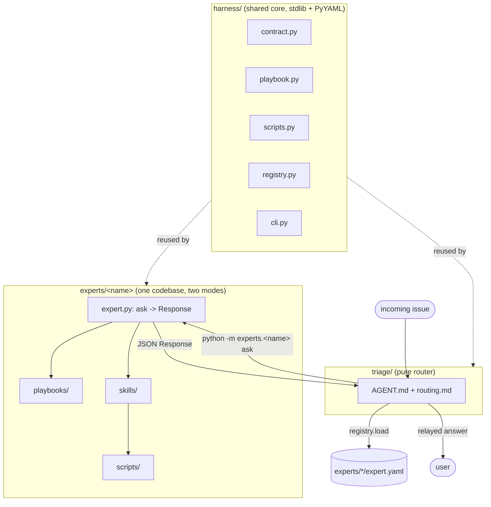

# Architecture

A **triage system** that grows expertise during interactive development and
promotes that knowledge into autonomous, callable agents.

## The model

- **Triage agent** = a **pure router**. It classifies an incoming issue, picks
  the right expert, calls it, and relays the answer. It holds **no** domain fixes
  itself — all knowledge lives in experts. See `../triage/AGENT.md`.

- **Expert agent** = the unit of knowledge and the **unit of promotion**. Each
  expert owns:
  - **playbooks** — known issue → fix (`playbooks/*.md`, YAML frontmatter for
    matching + Markdown body for the fix).
  - **skills** — research / data-gathering orchestration (`skills/*/SKILL.md`).
  - **scripts** — deterministic tools (`scripts/*`). Determinism lives here, not
    in model judgment.

- **Two faces from one codebase:**
  - **Interactive dev mode** — human-in-the-loop, used to *grow* an expert's
    playbooks/skills/scripts.
  - **Callable mode** — anyone (triage agent or a human) runs the expert and gets
    a structured answer back.

  Both faces read the **same** bundle, so there is no divergence.

- **Transport: CLI only.** An expert is invoked as a subprocess — question in,
  JSON out (see `CONTRACT.md`). MCP/HTTP are deferred.

## Shape

## The promotion path

Knowledge graduates from interactive to autonomous:

1. **Ad-hoc triage** — a human (in interactive dev mode) works through a new
   issue.
2. **Playbook** — a recurring pattern becomes a `playbook` (symptoms → fix).
3. **Skill + script** — the data-gathering steps become a `skill` orchestrating
   a deterministic `script`.
4. **Proven in dev mode** — exercised interactively until trusted.
5. **Wired into callable mode** — exposed through `ask()` / the CLI contract.
6. **Registered with triage** — discoverable via `expert.yaml`, so the router can
   reach it.

The detailed checklist is in `PROMOTION.md`.

## Why these boundaries

- The router stays dumb on purpose: domain knowledge has exactly one home (the
  expert), so it can be grown and versioned in one place.
- Scripts isolate determinism, so the reproducible parts of an expert can be
  trusted verbatim while the model handles judgment.
- One codebase per expert means the thing you grow interactively is exactly the
  thing that runs autonomously.

## Out of scope (today)

- A code-release expert (a named future consumer of this framework).
- MCP/HTTP transports (CLI only; contract leaves room for a wrapper).
- A fully proven real domain — `_template` is a skeleton.
- A real model-backed `ask()` — the `[sdk]` extra and `DEV.md` document the
  upgrade; the stub ships today.
